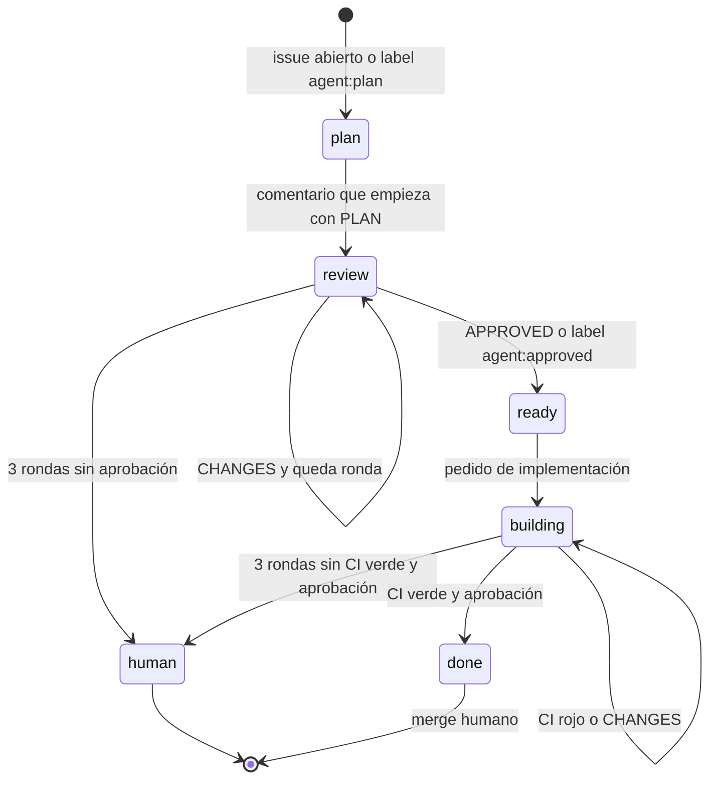

# Flujo de agentes

El issue lleva el estado. @cursor planifica e implementa. tebabot revisa. Una
persona mergea. No hay auto-merge: lo sigue rigiendo el ruleset de `main`.

El mapeo de estados ClickUp no cambia. Está en
[clickup-sync.md](clickup-sync.md). Cada transición deja un comentario en la
tarea, con un marcador `agent-orch-clickup:` para no duplicarlo. Si
`CLICKUP_API_TOKEN` no está, ese comentario se omite y el flujo de GitHub sigue.

## Estados

| Label               | Qué pasa                                                             |
| ------------------- | -------------------------------------------------------------------- |
| `agent:plan`        | Se pide a @cursor solo plan y diseño, sin código.                    |
| `agent:plan-review` | tebabot revisa el plan en el issue.                                  |
| `agent:ready`       | El plan fue aprobado. En la misma corrida pasa a implementación.     |
| `agent:building`    | @cursor abre el PR con `Closes #N`. tebabot revisa el PR.            |
| `agent:approved`    | Señal de aprobación. En el plan, dispara la implementación.          |
| `needs:human`       | Se agotaron las 3 rondas. Se avisa a @tebayoso. El flujo se detiene. |

Una sola fase a la vez. Si hay varias, gana `needs:human`, después
`agent:building`, `agent:ready`, `agent:plan-review` y `agent:plan`.

## Cómo se activa cada actor

@cursor arranca con una mención `@cursor` en un issue o un PR. La tiene que
escribir una persona con cuenta de Cursor vinculada, plan pago y permiso en el
repo. Cursor descarta, antes de mirar la configuración, los comentarios de bots
y de GitHub Apps. Eso incluye `github-actions[bot]` cuando el comentario sale
con `GITHUB_TOKEN`, y también un token de instalación de tebabot: sigue siendo
una GitHub App, así que no despierta a @cursor.

tebabot es la GitHub App `tebabot[bot]`, ya instalada. Este flujo la menciona
con `@tebabot` en el issue (el plan) y en el PR (la implementación). Un
comentario que ya publica sola, del estilo `Verdict: APPROVE` o
`Veredicto: Approve`, no cuenta como aprobación.

GitHub no vuelve a disparar workflows por eventos que crea `GITHUB_TOKEN`
(`issues`, `issue_comment`, `labeled`). Por eso la sync de ClickUp, en la misma
corrida que crea el issue abierto, publica la mención de plan con el secreto de
abajo. Si la publica `GITHUB_TOKEN`, @cursor no la ve y `agent-orch` tampoco
arranca.

### Secreto opcional

`AGENT_MENTION_TOKEN` es un PAT de @tebayoso (scope de repo público, permiso
para comentar). Ese usuario tiene Cursor vinculado, así que la mención `@cursor`
sale de una persona y no de un bot. El mismo token menciona a @tebabot y, si
hace falta, a @tebayoso.

Si el secreto no está, el workflow imprime un aviso y termina en cero. No rompe
el CI. La sync de ClickUp hace lo mismo y deja el issue en `agent:plan`.

`GITHUB_TOKEN` sigue usándose para leer, cambiar labels y dejar el comentario
final de merge, que no menciona a nadie. Las labels que pone no re-disparan el
workflow: la corrida hace el paso siguiente ella misma.

## Contrato de los comentarios

Los comentarios de este flujo llevan `<!-- agent-orch:... -->`. Esos no cuentan
como plan ni como revisión, aunque el autor sea @tebayoso (el PAT) o @cursor.
Así no hay un loop entre bots.

| Quién                                          | Cuenta como                                                                                                      |
| ---------------------------------------------- | ---------------------------------------------------------------------------------------------------------------- |
| @cursor                                        | Plan solo si el comentario empieza con `PLAN`.                                                                   |
| tebabot                                        | Aprobación si empieza con `APPROVED`, si la review del PR está `APPROVED`, o si el issue tiene `agent:approved`. |
| tebabot                                        | Cambios si empieza con `CHANGES` o si la review está `CHANGES_REQUESTED`.                                        |
| Cualquier otro, incluido `github-actions[bot]` | No avanza el estado.                                                                                             |

`Verdict: APPROVE` no aprueba y tampoco pide cambios. El pedido a tebabot dice
que use el prefijo.

Tope de 3 rondas en el plan y otras 3 en el PR. CI pendiente no gasta una ronda.
CI rojo, o un `CHANGES`, sí. Al agotar el tope: label `needs:human` y comentario
a @tebayoso. Una aprobación en la ronda 3 igual avanza.

Con el plan aprobado, el comentario es `@cursor Implementá el plan aprobado` y
pide un PR cuyo cuerpo tenga `Closes #N`. No se activa auto-merge.

Con CI verde y aprobación de tebabot, un comentario sin mención deja el PR listo
para que una persona lo mergee.

## Idempotencia

La decisión mira labels e historial de comentarios. Si el marcador del paso ya
está, no se vuelve a comentar. La concurrencia es una corrida por issue, o por
PR cuando el evento no trae número de issue, sin cancelar la que ya corre.
`workflow_dispatch` recorre los issues abiertos que ya tienen una label de este
flujo.

Las labels `agent:*` y `needs:human` no se copian como tags a ClickUp.
