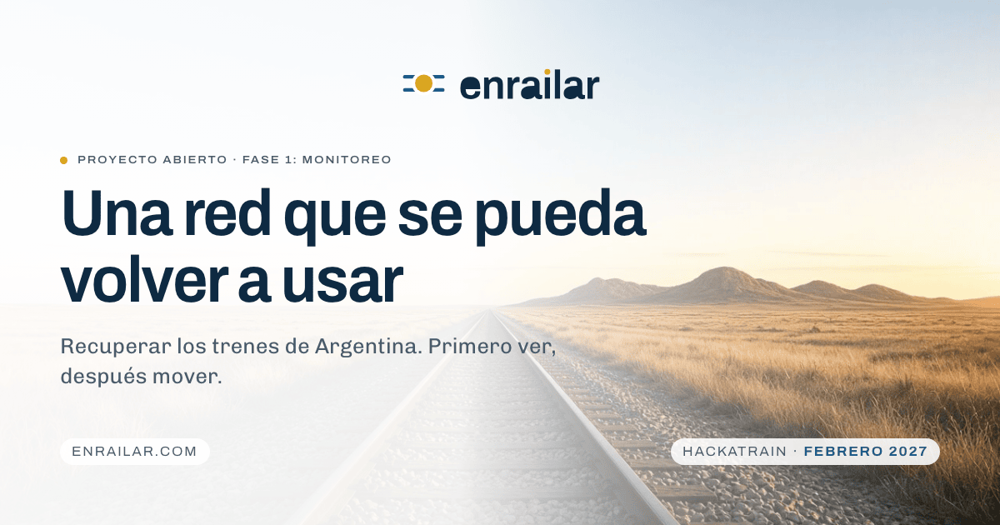
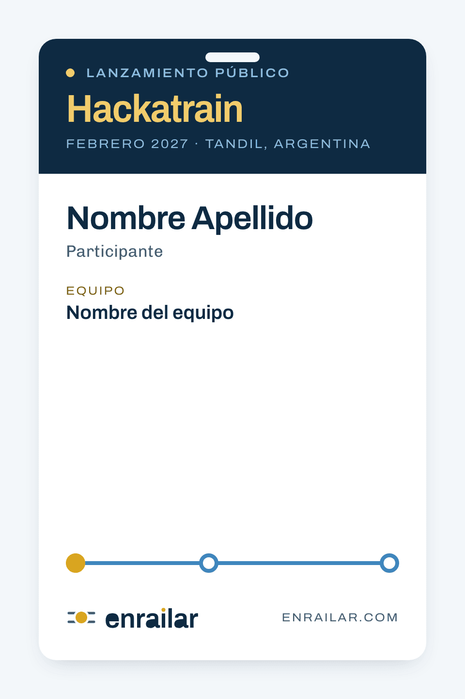
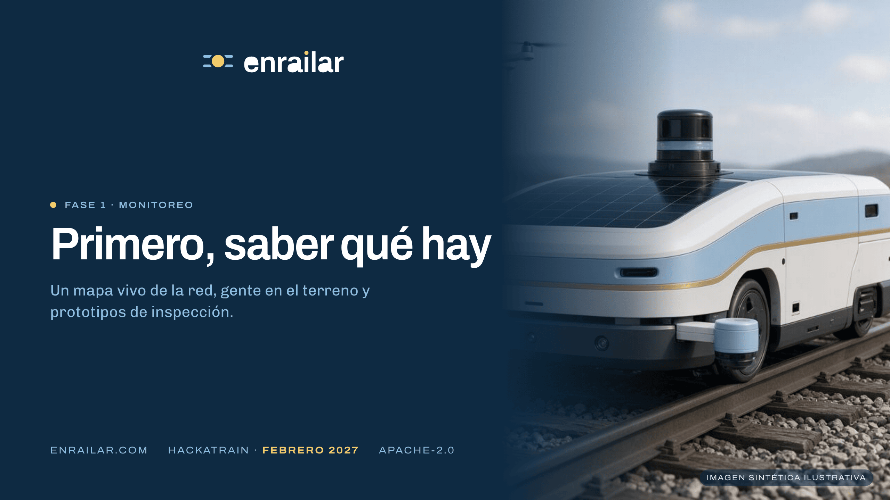
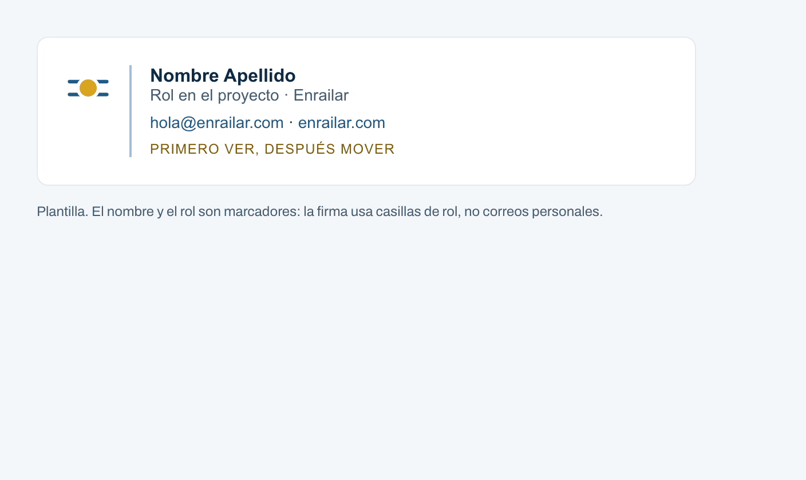

# Manual de marca · Enrailar

Versión 1.0 · octubre de 2026 · Vista navegable en [`index.html`](index.html).

Este manual define cómo se ve, cómo habla y cómo se aplica Enrailar. Los tokens viven en [`apps/web/app/globals.css`](../../apps/web/app/globals.css); los logos y las imágenes en [`apps/web/public/brand/`](../../apps/web/public/brand/). Los scripts que generan la paleta, el wordmark y los íconos están en [`scripts/brand/`](../../scripts/brand/).

## 1. ADN de marca

### Propósito

Que los trenes de Argentina vuelvan a servir, empezando por saber qué hay.

### Misión

Construir, en abierto, la tecnología y la organización para recuperar, mantener y operar la red ferroviaria: un mapa vivo de la infraestructura, inspección con robots y drones, software de coordinación y energía renovable en el corredor. Primero en Tandil, después en el resto del país y en América Latina.

### Visión

Una red que se pueda volver a usar: medida, mantenida y operada con evidencia pública, por una organización cooperativa donde quien firma una decisión de seguridad es una persona identificable.

### Valores

| Valor | Qué significa en la práctica |
| --- | --- |
| Abierto | Código, datos y protocolos públicos con licencia Apache-2.0. Lo que se construye se publica. |
| Cooperativo | Técnicos, trabajadores ferroviarios, municipios, comercios y usuarios en la misma mesa. |
| Transparente | Presupuestos, propuestas y avances se publican a medida que existen. Sin promesas sin fecha. |
| Responsable | La operación y las decisiones de seguridad quedan en profesionales identificables. |
| Concreto | Primero el mapa que se pueda verificar, después el prototipo, después el corredor. |

### Personalidad

Enrailar es una ingeniera de vía que explica con calma. Esperanzadora sin grandilocuencia, técnica sin jerga innecesaria, seria sin solemnidad. Cooperativa: habla de "nosotros" y nombra a los demás. Transparente: dice lo que no sabe.

### Voz y tono

Reglas:

- Oraciones cortas, verbos activos, un dato por frase.
- Se dice qué hay, qué falta y qué sigue. No se prometen fechas que no existen.
- Español rioplatense con voseo en la web ("Sumate", "Revisá"), inglés neutro en la versión EN.
- Nada de mayúsculas enfáticas, signos de exclamación ni superlativos.
- Los números van con unidad y contexto. Un escenario de carga es "para estudiar, no para prometer".

| Sí | No |
| --- | --- |
| "La fase 1 es monitoreo. Un mapa vivo de estaciones, vías y puentes, con fotos, fecha y estado." | "¡Estamos revolucionando el transporte argentino con tecnología de punta!" |
| "El anuncio no fija un día. La referencia es Febrero 2027." | "¡Muy pronto! Grandes novedades en camino." |
| "Prototipos sobre la vía, con energía solar y enlace donde no llega la cobertura." | "Robots autónomos con inteligencia artificial de última generación." |
| "Cada intervención queda escrita: el defecto, la obra y la capacidad que se recupera." | "Soluciones integrales end-to-end para el ecosistema ferroviario." |
| "Tres formas de entrar. Todas las lee una persona del proyecto." | "¡Unite a la comunidad más grande de amantes del tren!" |

## 2. Naming y tagline

**Enrailar** es un verbo: volver a poner sobre rieles. Se escribe con inicial mayúscula en prosa ("Enrailar es un proyecto abierto") y en minúsculas en el wordmark. No se traduce. No se abrevia.

Tres taglines propuestos:

1. **Primero ver, después mover.** Encadena la fase 1 (monitoreo) con lo que viene (operación). Encierra el método: evidencia antes de promesa.
2. Una red que se pueda volver a usar. Es el titular del sitio; funciona como tesis pero es largo para firma.
3. Trenes que se puedan medir. Técnico y honesto, pero deja afuera a la gente.

Elegido: **"Primero ver, después mover."** En inglés: **"See first, then move."** Se usa en el pie de la web, la firma de correo y la slide de portada. No se usa como titular ni junto al logo en tamaños chicos.

## 3. Logo

El logo son dos piezas: el **símbolo** (el nodo) y el **wordmark** (enrailar).

**Símbolo.** Dos rieles horizontales y un disco de oro que los interrumpe, como una estación en un diagrama de línea. El disco es el sol de mayo reducido a su forma esencial: un círculo, sin rayos ni rostro. Los rieles son celeste profundo.

**Wordmark.** "enrailar" en minúsculas, trazado a partir de Archivo (peso 640, ancho 100) con fontTools y guardado como contornos propios en SVG, sin dependencia de la fuente instalada. El punto de la i es el mismo disco de oro del símbolo: el sol como tilde.

| Versión | Archivo | Uso |
| --- | --- | --- |
| Horizontal | `logo-horizontal.svg` | Principal. Cabecera, pie, documentos. |
| Apilada | `logo-apilado.svg` | Formatos cuadrados o angostos: avatares, credenciales, sellos. |
| Monocromo | `logo-mono.svg`, `simbolo-mono.svg` | Un solo color (azul riel o negro). Sellos, grabado, impresión a una tinta. |
| Invertida | `logo-invertido.svg` | Sobre azul riel u otro fondo oscuro. Rieles celeste 300, sol oro 300, texto blanco. |
| Símbolo | `simbolo.svg` | Solo, cuando el nombre ya está dicho. |
| Wordmark | `wordmark.svg` | Solo en piezas donde el símbolo está aparte. |
| Favicon e íconos | `favicon.svg`, `favicon.ico` (16/32/48), `apple-touch-icon.png` (180), `icon-512.png`, `icon.svg` | Navegador, pantalla de inicio, manifest. |

### Área de seguridad y tamaños mínimos

- **Área de seguridad:** el diámetro del disco (una "S") en todos los lados. Nada entra en esa zona: ni texto, ni bordes, ni otras marcas.
- **Tamaños mínimos (pantalla):** horizontal 120 px de ancho; apilado 72 px; símbolo 16 px (favicon).
- **Tamaños mínimos (impreso):** horizontal 30 mm; apilado 18 mm; símbolo 5 mm.
- Por debajo de 24 px de alto se usa el símbolo solo.

Regeneración: `python3 scripts/brand/wordmark.py <Archivo.ttf> > wordmark.json && python3 scripts/brand/logo.py wordmark.json apps/web/public/brand && bash scripts/brand/raster.sh`.

## 4. Paleta

Celeste, blanco y oro, pero como material y no como bandera. El celeste de identidad (`celeste-300`) es un color de superficie y de línea; para texto y botones se usa su versión profunda (`celeste-700`). El oro aparece en puntos, nodos y acentos pequeños: nunca como fondo de texto largo. La tinta es `azul-riel`, un azul casi negro que reemplaza al negro puro.

Modo claro es el principal. Las variables semánticas (`--bg`, `--ink`, `--accent`, `--sol`...) permiten un modo oscuro opcional que ya está declarado bajo `:root[data-theme="dark"]` en `globals.css`, no activado.

La tabla y los contrastes salen de `python3 scripts/brand/palette.py --md`. El script falla si un par baja del mínimo.

| Token | Hex | RGB | OKLCH | Uso |
| --- | --- | --- | --- | --- |
| `--blanco` | #FFFFFF | 255 255 255 | oklch(1.000 0.000 0.0) | Fondo principal, superficies. |
| `--niebla` | #F3F7FA | 243 247 250 | oklch(0.974 0.006 239.8) | Fondo alterno de secciones, tarjetas sobre blanco. |
| `--celeste-100` | #D9EAF5 | 217 234 245 | oklch(0.928 0.024 236.0) | Tinte de superficie, bandas, estados hover suaves. |
| `--celeste-300` | #8DBEE2 | 141 190 226 | oklch(0.780 0.073 240.7) | Celeste de identidad. Decorativo: líneas, iconos grandes, fondos. |
| `--celeste-500` | #3E86BD | 62 134 189 | oklch(0.599 0.111 244.3) | Elementos de interfaz grandes (3:1): bordes activos, iconos, vía del diagrama. |
| `--celeste-700` | #1C5A88 | 28 90 136 | oklch(0.452 0.097 245.2) | Enlaces, botones primarios, foco. Texto sobre blanco. |
| `--azul-riel` | #0E2A42 | 14 42 66 | oklch(0.277 0.056 247.4) | Tinta principal: titulares y texto. Fondo del modo oscuro. |
| `--oro-300` | #F2CC6B | 242 204 107 | oklch(0.859 0.124 88.3) | Tinte de oro: fondos de etiqueta, halo del sol. |
| `--oro-500` | #D9A520 | 217 165 32 | oklch(0.750 0.147 84.4) | Oro del sol de mayo. Decorativo: puntos, nodos, subrayados. |
| `--oro-700` | #7E5E0B | 126 94 11 | oklch(0.502 0.099 84.3) | Texto o etiqueta en oro sobre blanco (AA). |
| `--balasto` | #4A5A68 | 74 90 104 | oklch(0.459 0.030 244.9) | Texto secundario, notas. |
| `--gris-100` | #E3EAF0 | 227 234 240 | oklch(0.933 0.011 243.7) | Líneas, bordes, separadores. |
| `--gris-300` | #B9C6D1 | 185 198 209 | oklch(0.820 0.021 243.5) | Bordes de campos, placeholders decorativos. |
| `--exito` | #1E6B3A | 30 107 58 | oklch(0.469 0.108 151.5) | Estado enviado. |
| `--error` | #A3331F | 163 51 31 | oklch(0.485 0.151 32.4) | Estado rechazado. |

| Frente | Fondo | Uso | Ratio | Mínimo | Resultado |
| --- | --- | --- | --- | --- | --- |
| `--azul-riel` | `--blanco` | Titulares y texto sobre blanco | 14.70:1 | 4.5:1 | AA ✓ |
| `--azul-riel` | `--niebla` | Texto sobre fondo alterno | 13.65:1 | 4.5:1 | AA ✓ |
| `--azul-riel` | `--celeste-100` | Texto sobre banda celeste | 11.93:1 | 4.5:1 | AA ✓ |
| `--balasto` | `--blanco` | Texto secundario | 7.11:1 | 4.5:1 | AA ✓ |
| `--balasto` | `--niebla` | Notas sobre fondo alterno | 6.60:1 | 4.5:1 | AA ✓ |
| `--celeste-700` | `--blanco` | Enlaces y texto en celeste | 7.32:1 | 4.5:1 | AA ✓ |
| `--celeste-700` | `--niebla` | Enlaces sobre fondo alterno | 6.80:1 | 4.5:1 | AA ✓ |
| `--blanco` | `--celeste-700` | Texto de botón primario | 7.32:1 | 4.5:1 | AA ✓ |
| `--blanco` | `--azul-riel` | Texto en pie de página / modo oscuro | 14.70:1 | 4.5:1 | AA ✓ |
| `--oro-700` | `--blanco` | Etiqueta en oro sobre blanco | 6.01:1 | 4.5:1 | AA ✓ |
| `--oro-300` | `--azul-riel` | Oro sobre tinta (pie, slide) | 9.54:1 | 4.5:1 | AA ✓ |
| `--celeste-300` | `--azul-riel` | Celeste claro sobre tinta (pie, slide) | 7.42:1 | 4.5:1 | AA ✓ |
| `--celeste-500` | `--blanco` | Componentes de interfaz (bordes, iconos) | 3.93:1 | 3.0:1 | AA ✓ |
| `--celeste-700` | `--celeste-100` | Anillo de foco sobre banda celeste | 5.94:1 | 3.0:1 | AA ✓ |
| `--exito` | `--blanco` | Mensaje de éxito | 6.52:1 | 4.5:1 | AA ✓ |
| `--error` | `--blanco` | Mensaje de error | 6.88:1 | 4.5:1 | AA ✓ |
| `--azul-riel` | `--oro-300` | Credencial: texto sobre oro claro | 9.54:1 | 4.5:1 | AA ✓ |

Reglas de uso:

- Texto largo: `azul-riel` sobre `blanco`, `niebla` o `celeste-100`.
- Enlaces y botones primarios: `celeste-700`. Nunca `celeste-300` ni `oro-500` como color de texto sobre fondo claro.
- Oro como texto solo en `oro-700` (sobre claro) u `oro-300` (sobre `azul-riel`).
- `celeste-500` para bordes activos, íconos y la vía del diagrama (mínimo 3:1 para componentes).
- Foco visible: anillo de 3 px `celeste-700`, separación 3 px.

## 5. Tipografía

Dos familias libres (SIL Open Font License 1.1) de **Omnibus-Type**, fundición de Buenos Aires, auto-hosteadas en `apps/web/public/fonts/` como WOFF2 variable, subconjunto latino (cubre todo el español e inglés). Las licencias están junto a los archivos.

| Rol | Familia | Ejes | Uso |
| --- | --- | --- | --- |
| Display | **Archivo** | peso 100–900, ancho 62–125 % | Titulares (peso 620–640, ancho 94–96 %), etiquetas en mayúsculas (peso 560, ancho 112 %, tracking 0.12–0.14 em), botones, navegación, cifras. |
| Texto | **Chivo** | peso 100–900 | Párrafos, formularios, notas. Peso 400, 17 px, interlínea 1.6. |

Archivo trae el gesto de los carteles de estación: ancho, mayúsculas espaciadas, grotesca. Chivo lee bien en bloques largos y mantiene la familia visual.

### Escala

Base 17 px (`--t-base`). Razón aproximada 1.2–1.25, con `clamp()` en los niveles grandes.

| Token | Tamaño | Uso |
| --- | --- | --- |
| `--t-xs` | 12 px | Etiquetas, leyendas de figura, pies |
| `--t-sm` | 14 px | Navegación, notas, campos |
| `--t-base` | 17 px | Texto |
| `--t-md` | 20 px | Ledes, títulos de tarjeta |
| `--t-lg` | 24 px | Títulos de formulario |
| `--t-xl` | 30 px | Fecha del evento, h1 de artículo chico |
| `--t-2xl` | 38 px | Dígitos de cuenta regresiva |
| `--t-3xl` | 35–51 px (fluido) | h2 de sección |
| `--t-4xl` | 42–77 px (fluido) | h1 del hero |

Interlíneas: `--lh-tight` 1.05 (h1), `--lh-snug` 1.25 (h2–h3), `--lh-body` 1.6. Ancho de medida: 64 caracteres (`--measure`).

## 6. Iconografía

Íconos de línea de 24 px, trazo 1.75 px, puntas y uniones redondeadas, un solo color (`currentColor`). Se dibujan en la misma cuadrícula que el símbolo: formas simples, sin relleno salvo un punto de énfasis. Los tres de la web están en [`apps/web/app/components/icons.tsx`](../../apps/web/app/components/icons.tsx): mapa, gente, dron. Para nuevos íconos: misma retícula, sin detalles por debajo de 2 px, probados a 20 px.

## 7. Imagen y fotografía

Las cuatro imágenes del sitio (`hero-pampa`, `robot-inspeccion`, `estacion-renovada`, `patron-red`) son **imágenes sintéticas ilustrativas, generadas con IA**. Se etiquetan siempre así, en la propia imagen (leyenda sobre la figura) o al pie. No representan lugares, equipos ni personas reales y no se usan como evidencia de estado de la red.

Cuando haya fotografías reales del relevamiento, reemplazan a las sintéticas y llevan lugar, fecha y autoría de rol (no personal).

Dirección de imagen:

- Luz natural, horizonte bajo, cielo amplio. La vía como línea que organiza el encuadre.
- Celeste del cielo y oro de la pampa a la hora dorada; blanco de galerías y equipos.
- Nada de drama: sin HDR, sin viñetas, sin filtros.
- Las personas aparecen trabajando, no posando.

Formatos: las fuentes son de 1280×720. Se sirven en AVIF y WebP a 480, 768 y 1280 px con JPEG de respaldo (`scripts/brand` no las genera: ver el comando en el PR). El hero se limita al ancho del contenedor (1152 px) para no escalar por encima de la fuente. A 2× de densidad el hero queda ligeramente blando: para una versión a sangre completa hay que regenerar las imágenes a 2560 px.

## 8. Patrones

- **Diagrama de línea.** Una vía (`celeste-500`, 4 px) con estaciones (anillos de 4 px) y la estación actual en oro. Es la firma de la marca: se usa para hojas de ruta, estados y credenciales. En móvil se vuelve vertical. Es un orden real, no decoración: cada nodo es un hito y el oro marca dónde estamos.
- **Nodo.** El símbolo reducido a su gesto: línea y punto. Como viñeta de lista, marcador de etiqueta (`.eyebrow--sol`) y separador.
- **Patrón de red.** `patron-red` (líneas celestes y puntos de oro sobre blanco) como textura de fondo a baja opacidad (≤ 0.35, modo multiplicar). Nunca detrás de texto chico.

## 9. Componentes UI

Todos en [`globals.css`](../../apps/web/app/globals.css); clases, no framework.

| Componente | Clase | Notas |
| --- | --- | --- |
| Botón primario | `.btn` | Fondo `celeste-700`, texto blanco, píldora. Hover a `azul-riel`. |
| Botón secundario | `.btn--ghost` | Borde `celeste-700`, fondo transparente. |
| Botón oro | `.btn--sol` | Solo sobre `azul-riel`. Texto `azul-riel` sobre `oro-300`. |
| Etiqueta | `.eyebrow` | Archivo 112 %, mayúsculas, línea o punto de oro. |
| Tarjeta | `.card` | Borde `gris-100`, radio 10 px, ícono + título + texto. |
| Figura | `.figure` | Radio 18 px, leyenda en píldora con "Imagen sintética ilustrativa". |
| Campo | `.field` | Borde 1.5 px `gris-300`, foco `celeste-700`. |
| Casilla de consentimiento | `.check` | Texto de la Ley 25.326 completo, nunca resumido. |
| Estado | `.status--ok`, `.status--error` | Verde `exito` y rojo `error`, con `role="status"`. |
| Banda oscura | `.section--dark` | `azul-riel`; texto blanco; acentos `oro-300` y `celeste-300`. |
| Cabecera | `.site-header` | Fija, desenfoque, logo horizontal a 32 px de alto. |
| Diagrama de línea | `.line-diagram` | Ver patrones. |

Accesibilidad incorporada: foco visible en todo, `prefers-reduced-motion` desactiva animaciones, enlace "Ir al contenido", etiquetas con `for`/`id`, contraste AA verificado.

## 10. Aplicaciones

Plantillas HTML en [`applications/`](applications/), renderizadas a PNG en [`assets/`](assets/) con Chrome headless. Usan las mismas fuentes y tokens que la web.

| Pieza | Plantilla | Render |
| --- | --- | --- |
| OG image (1200×630) | `applications/og.html` | `apps/web/public/brand/og.png` (la que usa la web) |
| Firma de correo | `applications/firma-email.html` | `assets/firma-email.png` |
| Credencial del Hackatrain | `applications/credencial.html` | `assets/credencial.png` |
| Slide de portada (16:9) | `applications/slide-portada.html` | `assets/slide-portada.png` |

Las plantillas usan marcadores ("Nombre Apellido", "Nombre del equipo") y casillas de rol (`hola@`, `hackatrain@`, `prensa@enrailar.com`). El repositorio es público: no van nombres, correos personales ni montos.

## 11. Usos incorrectos

- No usar la bandera argentina, el sol con rostro, escarapelas ni franjas celeste-blanco-celeste.
- No poner `celeste-300` ni `oro-500` como color de texto sobre fondo claro.
- No rellenar el disco con otro color, ni cambiar la proporción entre disco y rieles.
- No separar el punto de oro de la i del resto del wordmark, ni usar el wordmark en mayúsculas.
- No agregar sombras, degradados ni contornos al logo.
- No usar el logo invertido sobre fotografía sin una banda sólida detrás.
- No usar imágenes sintéticas sin su leyenda.
- No usar signos de exclamación, mayúsculas enfáticas ni "revolucionar", "disrupción", "de punta".
- No escribir fechas que no existen: mientras no haya un día, se escribe el mes.

## 12. Capturas

| Vista | Archivo |
| --- | --- |
| Home ES, escritorio 1440 | [`screenshots/home-es-1440.png`](screenshots/home-es-1440.png) |
| Home ES, móvil 390 | [`screenshots/home-es-390.png`](screenshots/home-es-390.png) |
| Home ES, móvil 390 (arriba del pliegue, 2×) | [`screenshots/home-es-390-fold.png`](screenshots/home-es-390-fold.png) |
| Home EN, escritorio 1440 | [`screenshots/home-en-1440.png`](screenshots/home-en-1440.png) |
| Bitácora ES, escritorio 1440 | [`screenshots/blog-es-1440.png`](screenshots/blog-es-1440.png) |
| Artículo ES, escritorio 1440 | [`screenshots/post-es-1440.png`](screenshots/post-es-1440.png) |
| Sitio anterior, referencia | [`../../.brand-input/brand-assets/enrailar-actual-1440.png`](../../.brand-input/brand-assets/enrailar-actual-1440.png) |
